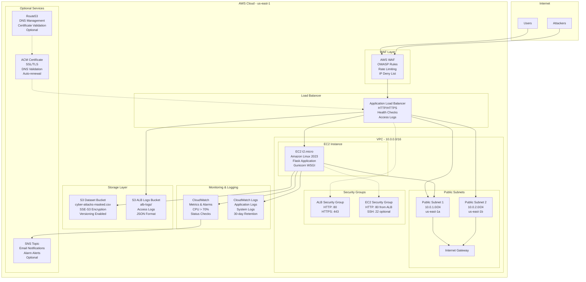
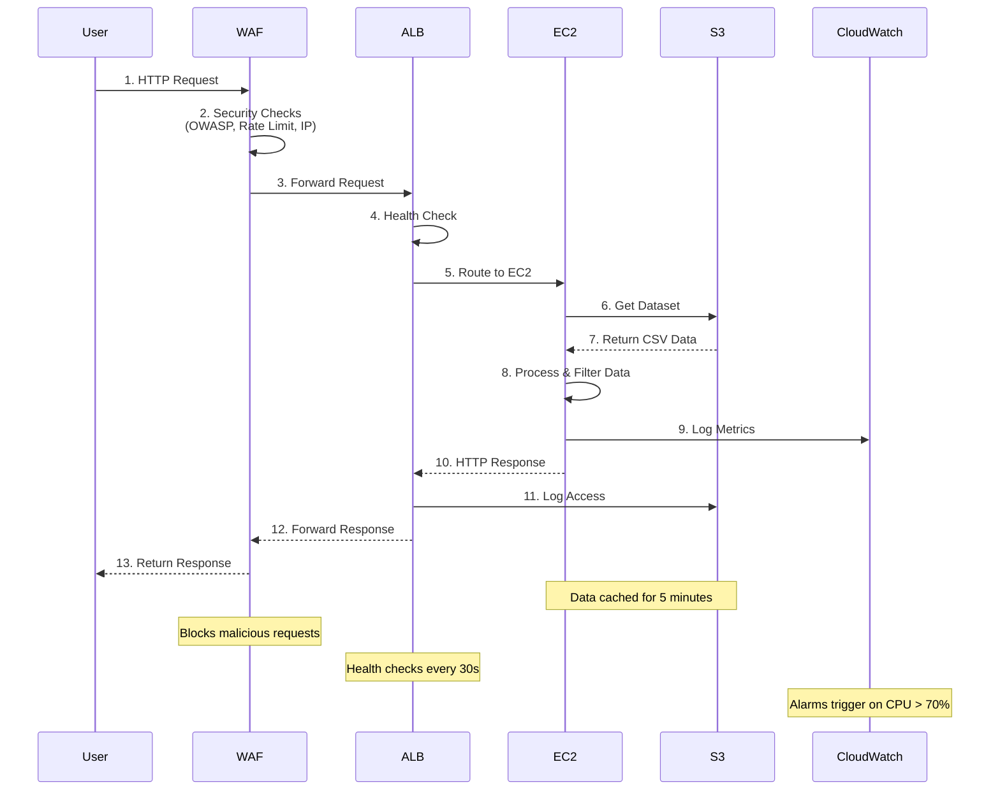
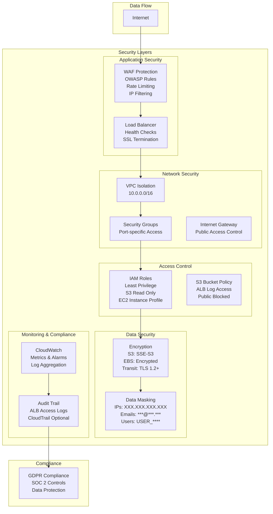
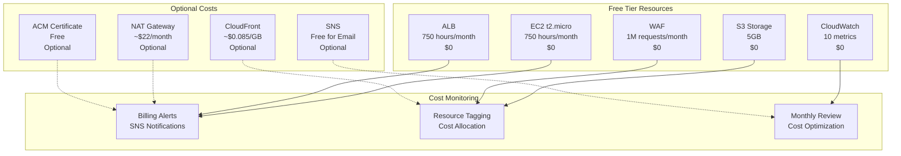
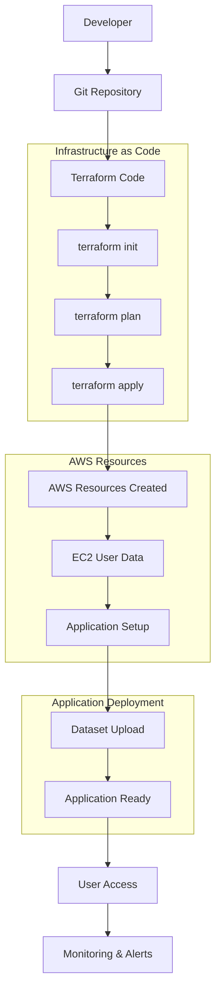
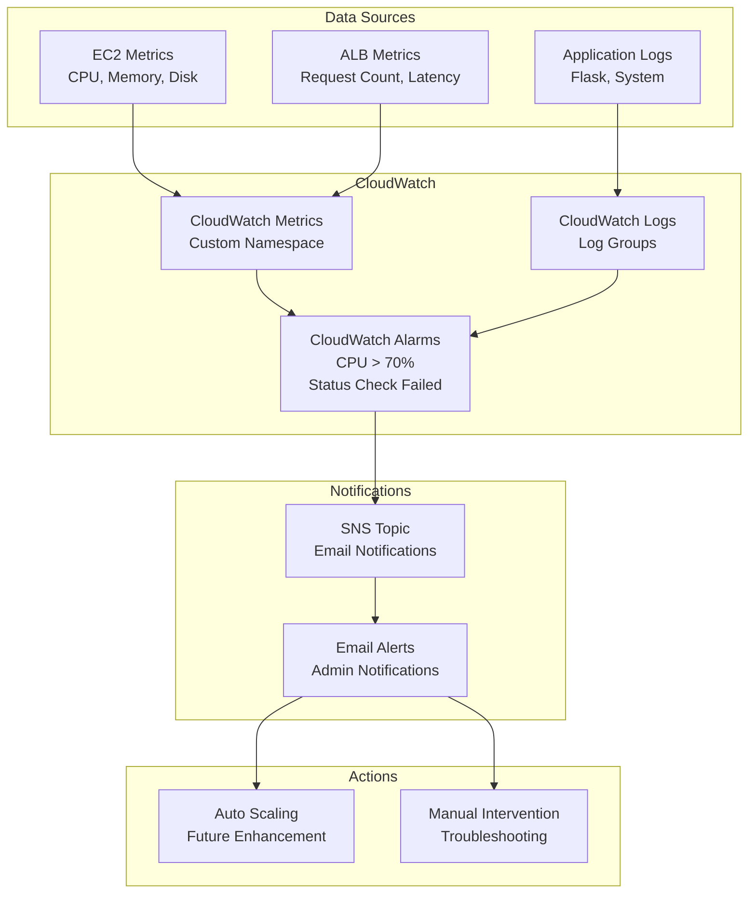
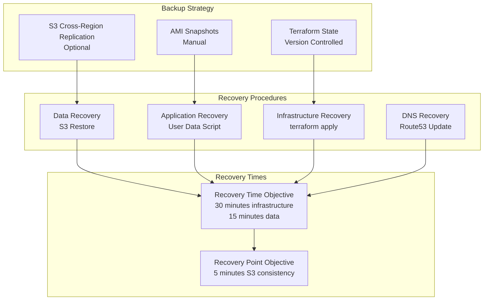
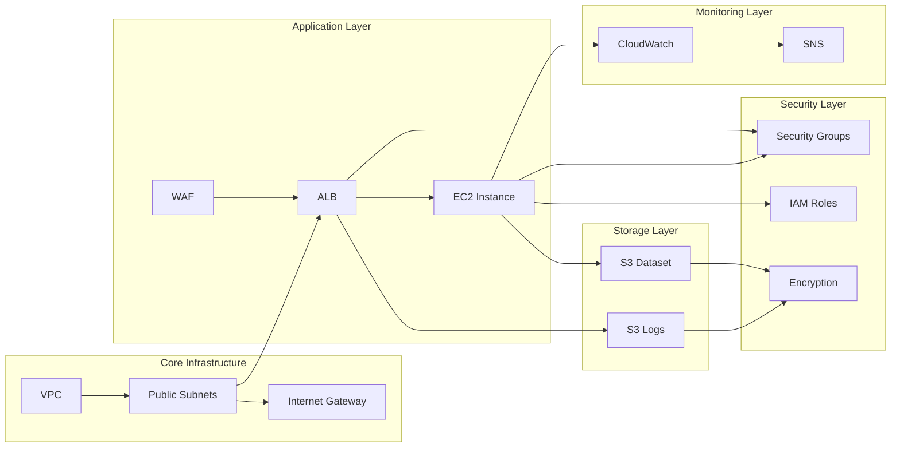

# Architecture Diagram

## System Overview

This document contains Mermaid diagrams illustrating the architecture of the Cybersecurity Dashboard infrastructure.

## High-Level Architecture

## Data Flow Diagram

## Security Architecture

## Cost Optimization Diagram

## Deployment Flow

## Monitoring and Alerting Flow

## Disaster Recovery Flow

## Component Relationships

This comprehensive set of diagrams illustrates the complete architecture, data flow, security layers, cost optimization, deployment process, monitoring, disaster recovery, and component relationships of the Cybersecurity Dashboard infrastructure.
